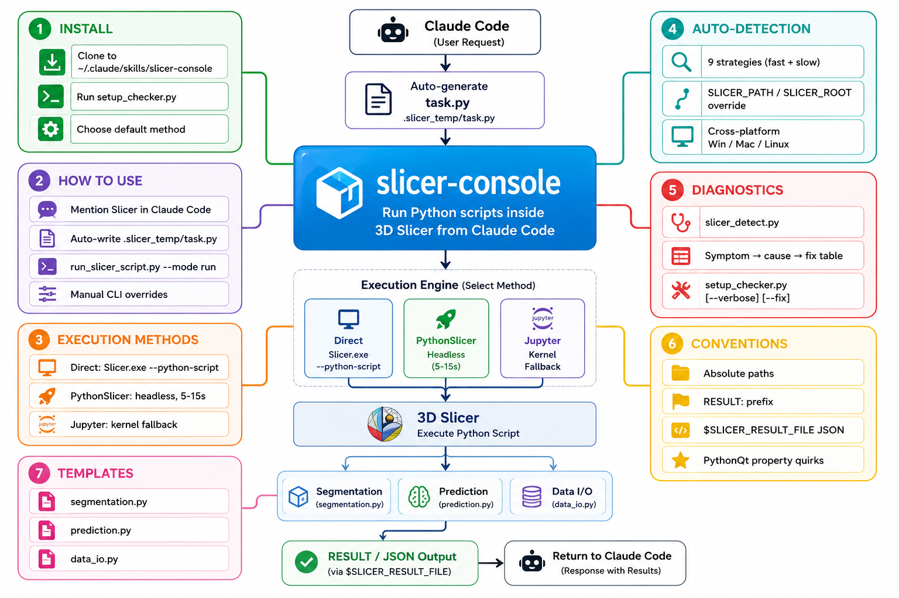
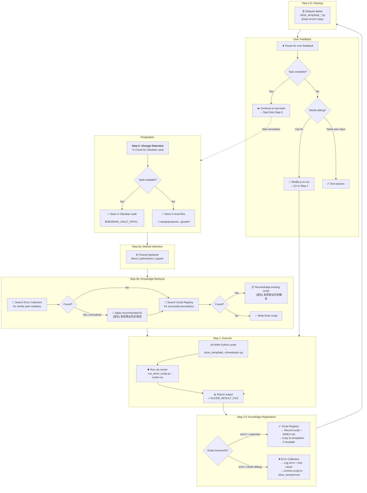

# slicer-console

**slicer-console** is a command-line tool that executes Python scripts inside **3D Slicer** from the terminal — no GUI clicks required.

It provides a unified runner with three execution backends, cross-platform auto-detection, structured output capture, ready-to-use templates for segmentation, inference, and data I/O, and a built-in **Growth Module** that learns from every task.



---

## Complete Workflow

The skill follows a structured, case-based workflow. The **Growth Module** (Steps 0 → 0b → 2.5) makes it smarter with every use by recording successes and failures for future retrieval.



> 💡 **Growth Module** (Steps 0, 0b, 2.5): The skill automatically stores every successful script in the **Script Registry** and every debugging session in the **Error Collection** (错题集). Before each new task, it retrieves relevant knowledge — first checking for past errors, then searching for reusable scripts — making the system smarter with every use.
>
> 📓 **Obsidian users**: Open `Workflow.canvas` in the vault for an interactive flowchart; use `Growth Module.base` for a table-view dashboard of all records.

---

## Quick start

### 1. Clone the repository

```bash
# Clone anywhere — this path is just a recommendation
git clone git@github.com:Kyler389/skill-slicer-console_v2.0.git /path/to/slicer-console
```

### 2. Verify your environment

```bash
cd /path/to/slicer-console/scripts
python setup_checker.py
```

This checks whether 3D Slicer is detected and which execution methods are available. Use `--verbose` for per-strategy details or `--fix` to auto-install optional dependencies.

### 3. Choose your default execution method (first time only)

The runner will ask you to pick a backend on first use, or you can create `scripts/config.json` manually:

```json
{"method": "direct", "updated": "2026-07-19T00:00:00"}
```

Allowed values: `direct`, `pythonslicer`, `jupyter`. You can always override with `--method <name>`.

---

## How to use

There are two ways to use slicer-console:

### A. Direct CLI (any agent or terminal)

Call the runner directly from any shell:

```bash
python /path/to/slicer-console/scripts/run_slicer_script.py \
  --mode run --script ./my_slicer_script.py
```

See the [CLI options](#common-cli-options) below for full control.

### B. Via an AI coding agent

Tell your agent you want to run something in Slicer, for example:

> "Run a Slicer script that lists all volumes in the scene."
> "Use Slicer to segment this volume and save the result."

A capable agent will:

1. Write a Python script using the Slicer Python API.
2. Save it to a temporary path (e.g. `./.slicer_temp/task_<timestamp>.py`).
3. Execute it via `run_slicer_script.py --mode run --script <path>`.
4. Return the output and the script path to you.

> **Agent-specific setup** (for tools that support skill manifests):
>
> - **Claude Code** — Clone into `~/.claude/skills/slicer-console/` and the bundled `skill.md` activates automatically on Slicer-related queries.
> - **Other agents** — Most agents can invoke `run_slicer_script.py` directly once they know the path. Add the scripts directory to your agent's context or tool configuration if supported.

### Common CLI options

| Flag | Description | Default |
|------|-------------|---------|
| `--script PATH` | Python script to execute | — |
| `--mode run\|launch` | Run mode | `run` |
| `--method auto\|direct\|pythonslicer\|jupyter` | Execution backend | `auto` |
| `--slicer-path PATH` | Override Slicer executable | auto-detected |
| `--module-paths "p1;p2"` | Extra module search paths | — |
| `--select-module NAME` | Select module on launch | — |
| `--kernel NAME` | Jupyter kernel name | `slicer-5.6` |
| `--timeout SEC` | Timeout in seconds | `300` |
| `--quit` / `--no-quit` | Auto-quit after script | `--quit` |
| `--kill-existing` | Kill running Slicer processes first | off |
| `--version` | Print detected Slicer version | — |

---

## Execution methods

| # | Method | Command | Startup | GUI | Best for |
|---|--------|---------|---------|-----|----------|
| 1 | **Direct** (default) | `Slicer.exe --no-splash --python-script` | 20–40s | Brief flash | Most reliable, full Slicer environment |
| 2 | **PythonSlicer** | `PythonSlicer.exe` / `python-real` | 5–15s | None | Headless batch processing |
| 3 | **Jupyter** | `jupyter_client` KernelManager | 20–40s | None | Legacy; warm kernel between runs |

The runner auto-selects the best available backend. Override anytime with `--method <name>`.

---

## Structured output

For reliable result capture (especially on Windows where GUI-app stdout may be lost), the runner sets `$SLICER_RESULT_FILE`:

```python
import os, json
result_file = os.environ.get("SLICER_RESULT_FILE")
if result_file:
    with open(result_file, "w") as f:
        json.dump({"status": "ok", "volume": "Sample"}, f)
```

The runner reads and displays this file after Slicer exits.

---

## Auto-detection

`slicer_detect.py` locates Slicer using 9 strategies in order:

| # | Strategy | Platforms | Description |
|---|----------|-----------|-------------|
| 1 | `SLICER_PATH` env var | All | Full path to Slicer executable |
| 2 | `SLICER_ROOT` env var | All | Directory containing Slicer executable |
| 3 | Common install paths | Win/Mac/Linux | Well-known default paths |
| 4 | Windows Registry | Win | `HKLM\SOFTWARE\Slicer` keys |
| 5 | `PATH` scan | All | Slicer on system `PATH` |
| 6 | Unix dirs + AppImage + `/Volumes` | Linux/Mac | Scans `~/Downloads/`, `/Applications/`, mounted `.dmg` |
| 7 | Program Files scan | Win | Walks `%PROGRAMFILES%` |
| 8 | Drive root scan | Win | Checks `C:\`, `D:\`, etc. |
| 9 | macOS Spotlight | Mac | `mdfind` to locate `Slicer.app` |

Fast mode (strategies 1–5) runs by default. Slow fallbacks activate only when needed.

Set a permanent path if detection fails:

```bash
# Windows
setx SLICER_PATH "D:\slicer\3D Slicer 5.10.0\Slicer.exe"

# macOS
export SLICER_PATH="/Applications/Slicer.app/Contents/MacOS/Slicer"

# Linux (AppImage)
export SLICER_PATH="$HOME/Downloads/Slicer-5.10.0-linux-amd64.AppImage"
```

---

## Script templates

Located in `scripts/templates/`:

| Template | File | Description |
|----------|------|-------------|
| Segmentation | `segmentation.py` | Load volume, threshold segmentation, export `.seg.nrrd` |
| Prediction | `prediction.py` | ML inference pipeline placeholder with volume I/O |
| Data I/O | `data_io.py` | Scene listing, volume export/import |

```bash
python /path/to/slicer-console/scripts/run_slicer_script.py \
  --mode run --script /path/to/slicer-console/scripts/templates/segmentation.py
```

---

## Scripting conventions

- **Absolute paths** for input/output files.
- **Print with `RESULT:` prefix** for easy parsing by both humans and agents.
- **Write structured results** to `$SLICER_RESULT_FILE`.
- **API fallback:** if a direct Slicer API raises `AttributeError`, try `slicer.modules.<moduleName>.logic()`.
- **No GUI dialogs** in `--python-script` mode — they block execution.
- **PythonQt properties:** in Slicer 5.10 / Python 3.12, attributes like `QWidget.layout`, `QSpinBox.value`, and `QLabel.text` are properties, not methods.
- **Avoid `setParent(None) + deleteLater()`** on Python `QWidget` subclasses — use `layout.removeWidget(w) + w.hide()` to prevent double-free crashes.

---

## Diagnostics & troubleshooting

```bash
# Quick environment check
python /path/to/slicer-console/scripts/setup_checker.py

# Detailed detection report
python /path/to/slicer-console/scripts/setup_checker.py --verbose

# Test auto-detection directly
python /path/to/slicer-console/scripts/slicer_detect.py
```

| Symptom | Likely cause | Fix |
|---------|-------------|-----|
| `Slicer not found` | Not installed or not detected | Set `SLICER_PATH`, pass `--slicer-path`, or run `setup_checker.py` |
| Slicer exits with code 0 but no output | Python 3.12 syntax error | Check script compatibility |
| Script hangs | Slicer window stays open | Use `--mode run` or `--kill-existing` |
| Jupyter `NoSuchKernel` | Kernel not registered | Use `--method direct` |
| Qt `setParent`/`deleteLater` crash | PythonQt double-free | Use `layout.removeWidget(w) + w.hide()` |
| `QWidget.layout()` crash | Layout is a property | Store layout as `self._layout = qt.QVBoxLayout(self)` |
| Linux AppImage module paths ignored | AppImage is read-only | Extract first: `./Slicer*.AppImage --appimage-extract` |

---

## Project structure

```
/path/to/slicer-console/
├── README.md                         # This file
├── skill.md                          # AI agent skill manifest (Claude Code)
├── .gitignore
├── references/
│   ├── CHANGELOG.md                  # Version history
│   ├── slicer-console-mindmap.png    # Overview mindmap
│   └── example_script.py             # Example usage
└── scripts/
    ├── run_slicer_script.py          # Main CLI entry point
    ├── slicer_detect.py              # 9-strategy auto-detection engine
    ├── setup_checker.py              # Environment diagnostics
    ├── config.json                   # Saved backend preference
    └── templates/
        ├── segmentation.py           # Volume segmentation template
        ├── prediction.py             # ML inference template
        └── data_io.py                # Data import/export template
```

---

## Requirements

- **Python 3.8+** (the runner runs in your external Python, not Slicer's)
- **3D Slicer** (any recent version; auto-detected)
- **`jupyter_client`** — only required for the Jupyter fallback method

---

## License

MIT — see [LICENSE](LICENSE) (or contact the project owner).

---

## Related

- [SlicerAgentController](https://github.com/Kyler389/SlicerAgentController) — Slicer module that inspired the direct `--python-script` approach
- [3D Slicer Documentation](https://slicer.readthedocs.io/)
